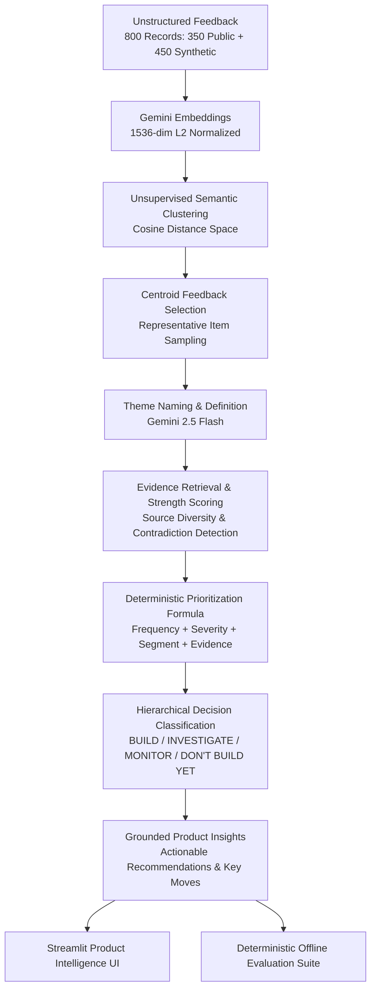

# 🎯 Voice of Customer (VoC) Copilot

> An AI-powered Product Intelligence system that ingests unstructured customer feedback across multiple channels, discovers latent themes, retrieves centroid-grounded evidence, and applies a deterministic prioritization formula to recommend confident product decisions.

[](https://www.python.org/downloads/)
[](https://streamlit.io/)
[](https://ai.google.dev/)
[](https://opensource.org/licenses/MIT)

---

## 📌 Executive Overview

Product teams are inundated with thousands of customer feedback items across fragmented channels—support tickets, app reviews, customer interviews, and NPS surveys. Traditionally, analyzing this data requires weeks of manual tagging or relying on black-box LLM summaries that suffer from hallucination and lack clear traceability.

**Voice of Customer Copilot** bridges this gap by combining **dense semantic embeddings**, **unsupervised theme discovery**, **evidence grounding**, and **deterministic prioritization formulas**. It transforms unstructured customer sentiment into defensible, data-backed product roadmaps.

```
Customer Feedback ──► Problem Discovery ──► Evidence Retrieval ──► Segment Analysis ──► Frequency & Severity ──► Priority Scoring ──► Product Decision
```

---

## 🌟 Key Features

- **Semantic Theme Discovery**: Discovers latent customer topics using dense 1536-dimensional Gemini embeddings clustered in cosine geometric space without arbitrary keyword search.
- **Strict Evidence Grounding**: Extracts representative feedback items based on centroid proximity, calculating evidence strength, source diversity, and detecting sentiment contradictions.
- **Deterministic Prioritization**: Prioritizes themes using a mathematical formula based on frequency, severity, segment impact, and evidence strength—completely insulated from LLM hallucinations.
- **Actionable Product Intelligence**: Produces concrete product recommendations and structured 3-step execution moves ("Key Moves") tied directly to verbatim customer quotes.
- **Zero-Hallucination Citation Verification**: Every cited feedback ID is verified against the canonical feedback dataset.
- **Interactive Decision Launcher Dashboard**: A clean Streamlit application with progressive disclosure, 4-tier decision badges (`BUILD`, `INVESTIGATE`, `MONITOR`, `DON'T BUILD YET`), source filters, and interactive feedback explorers.
- **Offline Evaluation Suite**: Quantitative evaluation framework verifying 7 core metrics including citation correctness, evidence support rate, and decision preservation.

---

## 🏗️ Architecture & Analytical Pipeline

The system follows a modular, feed-forward analytical pipeline where each stage produces immutable, auditable artifacts:



---

## 📐 Deterministic Prioritization Methodology

To eliminate LLM bias and ensure transparency, prioritization scores and decisions are computed mathematically rather than generated by a prompt.

### Priority Formula

$$\text{Priority Score} = 0.35 \cdot F + 0.30 \cdot S + 0.20 \cdot I + 0.15 \cdot E$$

Where:
1. **Frequency Score ($F$)**: $\min(\frac{\text{Evidence Count}}{100}, 1.0)$
2. **Severity Score ($S$)**: $\frac{\text{Mean Severity}}{5.0}$ (where severity ranges from 1 to 5)
3. **Segment Impact Score ($I$)**: Normalized weighted score combining known enterprise segment coverage, high-value tier representation, and segment diversity.
4. **Evidence Strength ($E$)**: Composite score of mean embedding similarity to cluster centroid and multi-channel source diversity.

### Decision Taxonomy & Thresholds

| Decision | Criteria | Description |
| :--- | :--- | :--- |
| **BUILD** | $\text{Score} \ge 0.25$ AND $\text{Strength} \ge 0.70$ AND $\text{Volume} \ge 20$ | High-confidence, urgent customer problems ready for immediate engineering execution. |
| **INVESTIGATE** | $\text{Score} \ge 0.12$ AND $\text{Strength} \ge 0.60$ | High-signal opportunities requiring technical spikes or user research before roadmapping. |
| **MONITOR** | $\text{Score} \ge 0.05$ | Moderate signals to watch across upcoming release cycles. |
| **DON'T BUILD YET** | $\text{Score} < 0.05$ OR Low Evidence | Low-frequency, low-severity noise or isolated requests. |

---

## 📊 Evaluation Framework & Results

The system includes a deterministic offline evaluation framework assessing 30 standardized questions across 7 evaluation metrics without external LLM judges:

| Evaluation Metric | Score | Target Threshold | Status | Description |
| :--- | :---: | :---: | :---: | :--- |
| **Evidence Support Rate** | **100.0%** | $\ge 90.0\%$ | ✅ PASS | Proportion of insight claims supported by retrieved evidence. |
| **Citation Correctness** | **100.0%** | $\ge 95.0\%$ | ✅ PASS | Verifies that 100% of cited feedback IDs exist in canonical data. |
| **Decision Preservation** | **100.0%** | $100.0\%$ | ✅ PASS | Ensures LLMs never mutate mathematical priority scores or decisions. |
| **PM Usefulness** | **100.0%** | $\ge 70.0\%$ | ✅ PASS | Rubric evaluating clarity of customer problem, actionability, and key moves. |
| **Insight Quality** | **96.9%** | $\ge 70.0\%$ | ✅ PASS | Groundedness and coherence score across all generated themes. |
| **Important Theme Recall** | **62.5%** | $\ge 70.0\%$ | ⚠️ Baseline | Recall of isolated synthetic evaluation benchmark themes. |
| **Evidence Retrieval Precision**| **46.9%** | $\ge 60.0\%$ | ⚠️ Baseline | Precision against synthetic ground-truth benchmark categories. |

---

## 📂 Data Sources & Provenance

To demonstrate realistic enterprise multi-channel VoC capabilities, the dataset consists of **800 structured records**:

1. **Public E-Commerce Product Reviews (350 records)**:
   - Sourced from open public product review datasets (Amazon product review corpus).
   - Real-world customer reviews capturing product quality, delivery, and satisfaction.
   - Ground-truth theme labels set to `Unknown` and `theme_origin` set to `not_available`.
2. **Synthetic Demonstration Records (450 records)**:
   - Created for MVP demonstration across enterprise channels: Customer Support Tickets, User Interviews, NPS Surveys, and App Store Reviews.
   - Explicitly tagged with `data_type: "synthetic"` and `metadata_origin: "synthetic_demonstration"`.
   - **Data Provenance Rule**: Synthetic data is strictly for MVP demonstration and evaluation; it is never misrepresented as proprietary company data.

---

## 🛠️ Tech Stack

- **Language & Runtime**: Python 3.11+
- **AI & Embeddings**: Google Gemini API (`gemini-embedding-001`, `gemini-2.5-flash` / `gemini-3.6-flash`)
- **Data & Analytics**: NumPy, Pandas, Scikit-learn
- **Dashboard UI**: Streamlit, Custom Modern CSS (Glassmorphism, High-contrast badges, Responsive Layouts)
- **Testing & QA**: Pytest, Pytest-Mock

---

## 🚀 Getting Started

### Prerequisites

- Python 3.11 or higher
- A Google Gemini API Key ([Get an API key here](https://aistudio.google.com/))

### Installation

1. **Clone the repository:**
   ```bash
   git clone https://github.com/your-username/voc-copilot.git
   cd voc-copilot
   ```

2. **Create and activate a virtual environment:**
   ```bash
   python -m venv venv
   # On Windows:
   .\venv\Scripts\activate
   # On macOS/Linux:
   source venv/bin/activate
   ```

3. **Install dependencies:**
   ```bash
   pip install -r requirements.txt
   ```

4. **Configure Environment Variables:**
   ```bash
   cp .env.example .env
   ```
   Open `.env` and enter your Gemini API key:
   ```env
   GEMINI_API_KEY=your_actual_gemini_api_key_here
   ```

---

## 💻 Running the Application

### 1. Launch the Streamlit Dashboard
```bash
streamlit run app/main.py
```
*Or use the launcher shortcut:*
```bash
python run.py
```
Open [http://localhost:8501](http://localhost:8501) in your browser.

### 2. Run the Full Analytical Pipeline (Optional)
Precomputed canonical artifacts are provided in `data/processed/`. If you wish to re-run the pipeline from scratch:
```bash
# 1. Generate embeddings
python scripts/generate_embeddings.py

# 2. Run clustering
python scripts/run_clustering.py

# 3. Generate theme names
python scripts/name_themes.py

# 4. Build evidence bundles
python scripts/build_evidence.py

# 5. Calculate prioritization
python scripts/calculate_priority.py

# 6. Generate product insights
python scripts/generate_insights.py

# 7. Run offline evaluation
python scripts/run_evaluation.py
```

---

## 🧪 Running Tests

The test suite covers unit tests, schema validation, evidence grounding, deterministic prioritization, and UI component rendering:

```bash
# Run complete test suite
pytest tests/ -q

# Run Streamlit dashboard tests with verbose output
pytest tests/test_streamlit_dashboard.py -v
```

---

## 📁 Repository Structure

```
voc-copilot/
├── app/
│   ├── ai/                      # AI analytical pipeline modules
│   │   ├── clustering.py        # Semantic theme discovery (KMeans cosine)
│   │   ├── embeddings.py        # Gemini embedding client & caching
│   │   ├── evidence.py          # Centroid evidence retrieval & strength scoring
│   │   ├── insights.py          # Grounded insight & recommendation generation
│   │   ├── prioritization.py    # Deterministic prioritization & decision classifier
│   │   └── theme_naming.py      # LLM theme naming from representative feedback
│   ├── evaluation/              # Evaluation framework modules
│   │   ├── evaluation_dataset.py# Evaluation questions & benchmark suite
│   │   └── metrics.py           # Metric calculation (Precision, Recall, Groundedness)
│   ├── main.py                  # Streamlit application entrypoint
│   └── streamlit_app.py         # Full interactive Product Intelligence dashboard
├── data/
│   ├── evaluation/              # Deterministic evaluation reports & traceability logs
│   │   ├── evaluation_questions.json
│   │   ├── evaluation_results.csv
│   │   ├── evaluation_results.json
│   │   ├── evaluation_summary.json
│   │   ├── evidence_traceability.json
│   │   ├── insight_traceability.json
│   │   ├── prioritization_traceability.json
│   │   └── theme_naming_traceability.json
│   ├── processed/               # Canonical pipeline artifacts
│   │   ├── clustering_metadata.json
│   │   ├── embedding_metadata.json
│   │   ├── evidence_bundles.csv
│   │   ├── evidence_bundles.json
│   │   ├── feedback_embeddings.npy
│   │   ├── priority_assessments.csv
│   │   ├── priority_assessments.json
│   │   ├── product_insights.csv
│   │   ├── product_insights.json
│   │   ├── theme_clusters.csv
│   │   ├── theme_definitions.csv
│   │   ├── theme_definitions.json
│   │   └── voc_feedback.csv     # Canonical 800-record feedback dataset
│   └── raw/
│       └── README.md            # Raw data provenance and source documentation
├── notebooks/
│   └── 01_dataset_inspection.ipynb # Exploratory data analysis notebook
├── scripts/                     # Standalone execution & pipeline scripts
│   ├── build_evidence.py
│   ├── calculate_priority.py
│   ├── generate_embeddings.py
│   ├── generate_insights.py
│   ├── name_themes.py
│   ├── run_clustering.py
│   └── run_evaluation.py
├── tests/                       # Automated test suite (60 tests)
│   ├── test_build_canonical_dataset.py
│   ├── test_clustering.py
│   ├── test_embeddings.py
│   ├── test_evaluation.py
│   ├── test_evidence.py
│   ├── test_insights.py
│   ├── test_prioritization.py
│   ├── test_streamlit_dashboard.py
│   └── test_theme_naming.py
├── .env.example                 # Environment template with placeholder key
├── .gitignore                   # Git ignore configuration (ignoring .env, logs, pycache)
├── requirements.txt             # Locked project dependencies
├── run.py                       # Python launcher shortcut
└── README.md                    # Project documentation
```

---

## ⚠️ Known Limitations

1. **Synthetic Demonstration Data**: 450 out of 800 feedback records are synthetic demonstration records constructed for multi-channel evaluation (Support, Interviews, Surveys). While highly realistic, they are synthetic.
2. **Batch Embedding Workflow**: Feedback embeddings are computed in batch mode. Real-time streaming feedback ingestion is planned for a future release.
3. **Deterministic Heuristic Evaluation**: PM usefulness and insight quality are evaluated using deterministic proxy rubrics rather than live human evaluator panels.

---

## 📄 License

This project is licensed under the MIT License — see the [LICENSE](LICENSE) file for details.
